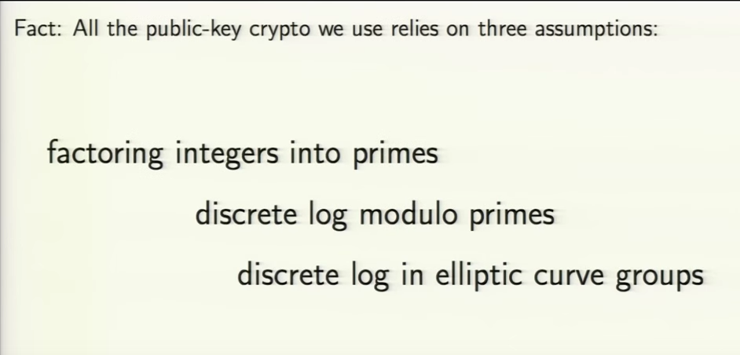

## Public Key Cryptography and Identifiers

Prepared for PIDapalooza 2016
Reykjavik, Iceland

- Max Ogden
- Computer Programmer, http://datproject.org, a non-profit building open source software to manage and share datasets
- Co-organizer, http://csvconf.com
- Not a security expert

### Secure Hashes

- Look like 2074f99641956dad041837828af141b552633a4c
- Basis of modern version control and security
- Fingerprints/checksums
- Unique and secure
- Not meant for user consumption (domain names, url shorteners, git tags)

### Keys

- https://events.ccc.de/congress/2014/Fahrplan/events/6369.html
- Keybase: Public key crypto for everyone, publicly auditable proofs of identity.
- Identity proofs: "I am Joe on Keybase and MrJoe on Twitter"
- Follower statements: "I am Joe on Keybase and I just looked at Chris's identity"
- Key ownership: "I am Joe on Keybase and here's my public key"
- Revocations: "I take back what I said earlier"
- https://keybase.io/docs/server_security#what-keybase-is-really-doing
- Who stores the keys?
- What happens when the user forgets their password?

### Signatures

- Look like '2074f99641956dad041837828af141b552633a4c'
- Digital proof of an event, anything can be signed
- How do you prove something is persistent?
- Who produced this data or edit?
- Has data I received been tampered with?
- https://ed25519.cr.yp.to/
- https://nacl.cr.yp.to/
- http://www.merkle.com/papers/Certified1979.pdf
- https://en.wikipedia.org/wiki/Merkle_tree
- 📍🌍💩👼💊🍃🍷🍃🐊👅⛄️🎵🔋👊🐫🍁🐜🎂🐇🐣🐾👛📚👇🍟🐝🎲😭🎈🎊🙏🐜

### Discovery

- The Internet is fast, silos make it slow
- Who online has a copy of this data?
- Discovering multiple sources of data ("Content addressable")
- Self healing links
- Faster downloads, less bandwidth costs
- Avoids unnecessary dependency on cloud services
- Endangered data list
- Dat Project: "Identifying data and digitally signing data sets"

- https://pdos.csail.mit.edu/~petar/papers/maymounkov-kademlia-lncs.pdf
- http://www.bittorrent.org/beps/bep_0044.html
- https://github.com/datproject/docs/blob/2074f99641956dad041837828af141b552633a4c/papers/dat-paper.md#24-kademlia-distributed-hash-table
- https://github.com/datproject/docs/blob/master/docs/how-dat-works.md#phase-1-source-discovery

### Registers

- "Authoritative lists you can trust"
- Basis of the UK Governments open data infrastructure plan
- Enables third party trust
- Blockchains without the need for economic incentives
- https://www.certificate-transparency.org/log-proofs-work
- https://www.gov.uk/government/publications/registers/registers
- https://gds.blog.gov.uk/2015/09/01/registers-authoritative-lists-you-can-trust/

### Open Questions

- What can PID infrastructure learn from the Internet infrastructure?
- What security properties should PIDs include? What use cases would they enable?
- Is trusting a central authority (PID infrastructure) OK?
- How do we prove anything with the PID infrastructure goes away?
- What are current PID central points of failure/dependence and is there a benefit to avoiding them?
- For massive datasets, are distributed networks necessary and if so what role does the PID infrastructure play?
